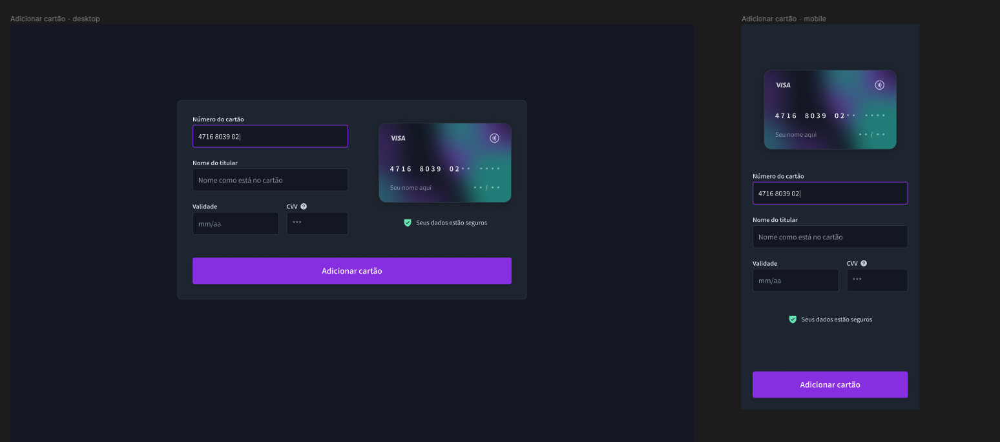

<h1 align="center"> #13 Form de um cartão de crédito </h1>

É o #13 desafio <a href="https://boracodar.dev/">#BORACODAR</a> da RocketSeat 

  <a href="#-tecnologias">Tecnologias</a>&nbsp;&nbsp;&nbsp;|&nbsp;&nbsp;&nbsp;
  <a href="#-projeto">Projeto</a>&nbsp;&nbsp;&nbsp;|&nbsp;&nbsp;&nbsp;
  <a href="#-layout">Layout</a>&nbsp;&nbsp;&nbsp;|&nbsp;&nbsp;&nbsp;
  <a href="#-collaborators">Collaborators</a>&nbsp;&nbsp;&nbsp;|&nbsp;&nbsp;&nbsp;

 

  

## 🚀 Tecnologias

Esse projeto foi desenvolvido com as seguintes tecnologias:

- HTML
- CSS
- JavaScript
- React
- Git e Github
- Figma
- Next

## 💻 Projeto

O projeto _Cartão de crédito_ foi realizado como parte do #13 desafio #BORACODAR da RocketSeat sugerido pelo professor <a href="https://github.com/maykbrito" alt="Link para o GitHub do professor Mayk Brito" target="_blank">Mayk Brito</a>.

<h1 align="center">
  Funcionalidades
</h1>

O desafio foi a criação de um form de cartão de crédito além do layout proposto disponível em  <a href="#-layout-figma">Layout</a>, algumas animações e interações.

### Preenchendo os campos

Dependendo do número de cartão digitado, será detectado a bandeira do cartão automaticamente, para o botão de adicionar cartão ficar habilitado, é necessário preencher os campos.

### Animação

A animação de virar o cartão, acontece quando o CVV fica em focus

_<h2 align="center" ><a href="https://kanban-boracodar.vercel.app" target="_blank">Visite o projeto online</a></h2>_

## 🔖 Layout

Você pode visualizar o layout proposto pela RocketSeat através do da <a href="#-layout-figma">imagem abaixo</a>. Disponibilizado pelo [Figma](https://figma.com) durante o período do desafio.

  

## 📃 Collaborators

This challange was made by [Julia](https://gsajulia.github.io) and [Ricardo](https://rickazuo.github.io/portfolio/)
